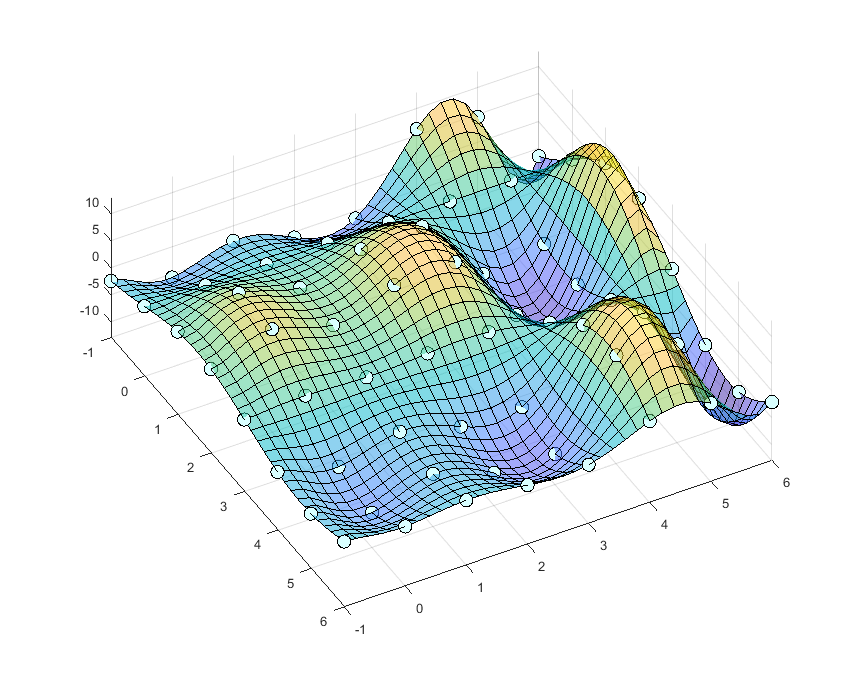

<a name="readme-top"></a>
<!--
*** Thanks for checking out the Best-README-Template. If you have a suggestion
*** that would make this better, please fork the repo and create a pull request
*** or simply open an issue with the tag "enhancement".
*** Don't forget to give the project a star!
*** Thanks again! Now go create something AMAZING! :D
-->


<!-- PROJECT SHIELDS -->
<!--
*** I'm using markdown "reference style" links for readability.
*** Reference links are enclosed in brackets [ ] instead of parentheses ( ).
*** See the bottom of this document for the declaration of the reference variables
*** for contributors-url, forks-url, etc. This is an optional, concise syntax you may use.
*** https://www.markdownguide.org/basic-syntax/#reference-style-links
-->


<!-- PROJECT LOGO -->
<br />
<div align="center">
  <a>
    
  </a>
  <h3 align="center">NdimSpline_JAX</h3>
  A multidimensional spline interpolation by Google/JAX
  
<br />
<br />

🚛The old repository of this project (**ndimsplinejax@nmoteki**) has moved here as my old github account **nmoteki** is no longer maintained!

</div>


<!-- TABLE OF CONTENTS -->
<details>
  <summary>Table of Contents</summary>
  <ol>
    <li>
      <a href="#about-the-project">About The Project</a>
    </li>
    <li>
      <a href="#getting-started">Getting Started</a>
      <ul>
        <li><a href="#prerequisites">Prerequisites</a></li>
        <li><a href="#installation">Installation</a></li>
      </ul>
    </li>
    <li><a href="#usage">Usage</a></li>
    <li><a href="#jupyter notebook version">Jupyter Notebook version</a></li>
    <li><a href="#license">License</a></li>
    <li><a href="#contact">Contact</a></li>
    <li><a href="#acknowledgments">Acknowledgments</a></li>
  </ol>
</details>


<!-- ABOUT THE PROJECT -->
## About The Project

Interpolant is an efficiently-computable mathematical function that models a discrete dataset. Interpolant is an indispensable tool for mathmatically incorpolating observational data to physical simulations or statistical inferences without appreciable biases. This can be contrast to regression models (e.g., multilayer perceptron) that almost always suffers from under-or-over fitting issue to some extent.

There have been many interpolation code/software available; however, I didn't find any multidimensional interpolant compatible with both Just-In-Time compilation and Automatic Differentiation when I starded this project in mid 2022. In my research, I needed such interpolant for applying a recent Hamiltonian-MC code to my Bayesian inverse problem wherein the forward model is only accessible through a pre-computed discrete look-up table. In that case, the forward model, a light-scattering simulator for nonspherical particles, is computationally too complex to execute in place. So, I decided to develop this NdimSpline_JAX. I'd like to share the codes hoping they are useful for scientists and engineers.

### Functionalities:
* `compute_coefs` computes the natural-cubic spline coefficients from scalar y data on an N-dimensional Cartesian grid, using a separable tensor-product approach with O(N·M<sup>N+1</sup>) complexity.
* `make_interpolant` creates a JIT & Autograd compatible interpolant that uses localized evaluation (only 4<sup>N</sup> coefficients per query point).
* On each dimensional axis, x grid-points must be equidistant. The grid-points interval can be different among axes.
* Works for any number of dimensions N (no hardcoded dimension limit).

#### Comments:
* The requirement of "equidistant grid-points on each axis" would not be a serious limitation in practice. A user can project/approximate a non-equidistant gridded data to equidistant gridded data by a mathematical transformation of each variable.

### Performance (v1.0.1 vs v0.1.2)

Benchmarked on 5D data with `n = [10, 10, 10, 10, 10]` (11 grid points per axis), CPU (WSL2), float64. All JIT timings are post-warmup averages over 1000 calls.

| Operation | v0.1.2 (old) | v1.0.1 (new) | Speedup |
|---|---|---|---|
| Coefficient computation | 96.6 s | 0.61 s | **158x** |
| JIT eval | 3.1 ms | 106 us | **30x** |
| JIT grad | 113.5 ms | 111 us | **1,022x** |
| JIT value_and_grad | 113.4 ms | 108 us | **1,046x** |

| Operation | v0.1.2 (old) | v1.0.1 (new) |
|---|---|---|
| Coefficient computation (peak memory) | 16.8 MB | 1.6 MB |

Key improvements:
* **Coefficient computation**: Separable tensor-product TDMA solver replaces dense `scipy.linalg.solve` — O(N·M<sup>N+1</sup>) vs O(M<sup>3N</sup>).
* **Evaluation / gradient**: Localized `dynamic_slice` extracts only 4<sup>N</sup> = 1,024 coefficients per query, instead of scanning all (n+3)<sup>5</sup> = 371,293 entries.


<p align="right">(<a href="#readme-top">back to top</a>)</p>

<!-- GETTING STARTED -->
## Getting Started

This is an example of how you use the modules on your local computer. The author tested the codes using Python 3.12.8 on Windows 11 machine and Python 3.12.9 on WSL (Ubuntu).

### Prerequisites
* An execution enviroment of Python >= 3.12 on Linux, MacOS, or WSL2 on Windows
* Installation of `jax` module, and optionally `ipykernel` module if you execute JupyterNotebook files.

<p align="right">(<a href="#readme-top">back to top</a>)</p>

### Installation
   ```sh
   git clone https://github.com/NobuhiroMoteki/NdimSpline_JAX.git
   ```
<p align="right">(<a href="#readme-top">back to top</a>)</p>

### Usage
Here is the workflow for an example of 5-dimensional x-space (N=5):

1. Define the grid information and prepare observation data.

    ```py
    import numpy as np

    a = [0, 0, 0, 0, 0]       # lower bounds for each dimension
    b = [1, 2, 3, 4, 5]       # upper bounds for each dimension
    n = [10, 10, 10, 10, 10]  # number of grid intervals per dimension
    N = len(a)

    # Generate gridded data (replace with your own data in actual use)
    grids = [np.linspace(a[j], b[j], n[j] + 1) for j in range(N)]
    mesh = np.meshgrid(*grids, indexing="ij")
    y_data = np.ones_like(mesh[0])
    for j in range(N):
        y_data *= np.sin(mesh[j])
    ```

2. Compute spline coefficients and create the interpolant.

    ```py
    import jax.numpy as jnp
    from ndim_spline_jax import compute_coefs, make_interpolant

    c = compute_coefs(N, jnp.array(y_data))
    s = make_interpolant(a, b, n, c)
    ```

3. Evaluate, differentiate, and JIT-compile.

    ```py
    from jax import jit, grad, value_and_grad

    x = jnp.array([0.7, 1.0, 1.5, 2.0, 2.5])  # must satisfy a <= x <= b

    print(s(x))                      # evaluate
    print(grad(s)(x))                # gradient
    print(value_and_grad(s)(x))      # value and gradient

    s_jit = jit(s)                   # JIT-compiled (much faster after warm-up)
    print(s_jit(x))
    print(jit(grad(s))(x))
    print(jit(value_and_grad(s))(x))
    ```

For executing this example, just run the `caller.ipynb` on JupyterNotebook or execute the `caller.py` script.

<p align="right">(<a href="#readme-top">back to top</a>)</p>


## Technical Note

For a detailed description of the mathematical theory (B-spline formulation, tridiagonal system, Kronecker factorization, localized evaluation) and the mapping to the implementation, see **[technical_note_theory.md](technical_note_theory.md)**.


## Supplemental materials
The `./jupyter_notebooks` subfolder contains `.ipynb` files scripting the individual dimensional cases. These files would help user's understandings or customizations.


## Reference

* **Maths of multidimensional natural-cubic spline interpolation:** Habermann and Kindermann 2007, Multidimensional Spline Interpolation: Theory
and Applications, DOI: 10.1007/s10614-007-9092-4.
* **Google/JAX reference documentation:** https://jax.readthedocs.io/en/latest/
* **An introduction of Google/JAX for scientists (in Japanese):** https://github.com/HajimeKawahara/playjax


## License

Distributed under the MIT License. See `LICENSE.txt` for more information.

<p align="right">(<a href="#readme-top">back to top</a>)</p>

## Contact
Nobuhiro Moteki - nobuhiro.moteki@gmail.com

Project Link: [https://github.com/nmoteki/ndimsplinejax.git](https://github.com/nmoteki/ndimsplinejax.git)

<p align="right">(<a href="#readme-top">back to top</a>)</p>


<!-- ACKNOWLEDGMENTS -->
## Acknowledgments
This code-development project was conceived and proceeded in a part of the N.Moteki's research on atmospheric chemical composition in the NOAA Earth System Science Laboratory, supported by a fund JSPS KAKENIHI 19KK0289.

<p align="right">(<a href="#readme-top">back to top</a>)</p>
